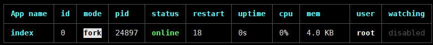

### 教你一步步从阿里云Ubuntu服务器部署node项目

#### 一 先解析域名。如下图所示
  

#### 二 服务器上添加安所示如下图所示

  

#### 三 服务器安装node

  1. 下载源码，你需要在 https://nodejs.org/en/download/ 下载最新的Nodejs版本，本文以v8.11.1为例:
  ```shell
    cd /usr/local/src/
    wget http://nodejs.org/dist/v8.11.1/node-v8.11.1.tar.gz
  ```
  2. 解压源码
  ```shell
    tar zxvf node-v8.11.1.tar.gz
  ```
  3. 编译安装
  ```shell
    cd node-v8.11.1
    ./configure --prefix=/usr/local/node/8.11.1
    make && make install
  ```
  4. 配置NODE_HOME，进入profile编辑环境变量
  ```shell
    vim /etc/profile
  ```
  设置nodejs环境变量，在 <strong>export PATH USER LOGNAME MAIL HOSTNAME HISTSIZE HISTCONTROL</strong> 一行的上面添加如下内容:假如环境变量已经自动设置好了那就更好了。

  ```shell
    #set for nodejs
    export NODE_HOME=/usr/local/node/8.11.1
    export PATH=$NODE_HOME/bin:$PATH
  ```
  :wq保存并退出，编译/etc/profile 使配置生效

  ```shell
    source /etc/profile
  ```
  验证是否安装配置成功

  ```shell
    node -v
  ```
  输出 v8.11.1 表示配置成功

#### 四 mongodb数据库的安装

  1. 创建一文件夹，存放将要下载的mongodb文件.

  ```shell
    mkdir /usr/local/mongodb
  ```
  2. 下载你需要的mongodb文件 https://fastdl.mongodb.org/linux/mongodb-linux-x86_64-ubuntu1404-3.6.3.tgz

  ```shell
    wget https://fastdl.mongodb.org/linux/mongodb-linux-x86_64-ubuntu1404-3.6.3.tgz
  ```
  3. 解压文件,解压到mongodb文件夹下
  ```shell
    tar -xvf mongodb-linux-x86_64-ubuntu1404-3.6.3.tgz -C /usr/local/mongodb/
  ```
  4. 创建数据保存路径
  ```shell
    mkdir /usr/local/mongodb/data
  ```
  5. 创建数据保存路径
  ```shell
    mkdir /usr/local/mongodb/log
  ```
  6. 修改解压后生成的文件，
  ```shell
    mv mongodb-linux-x86_64-1404-3.6.3 server
  ```
  7. 进入mongodb文件的bin目录下，准备启动mongodb
  ```shell
    cd usr/local/mongodb/server/bin/
  ```
  8. 启动和配置文件和日志保存的路径
  ```shell
    ./mongod --dbpath=/usr/local/mongodb/data/ --logpath=/usr/local/mongodb/log/mongo.log
  ```
  > 出现下面所显示的证明 启动和配置文件和日志保存路径成功
  
  9. 这个时候，mongodb已经启动完成了，如需对mongodb进行操作，需要另打开一个终端，链接到服务器，进入到usr/local/mongodb/server/bin/目录下
  ```shell
    cd usr/local/mongodb/server/bin/
  ```
  10. 输入命令启动mongodb数据库
  ```shell
    ./mongo
  ```
  > 提示Server has startup warnings: 服务已经启动，然后就可以对数据库进行操作了，比如增，删，改，查.完成了，是不是很简单啊！
  11. 检查是不是这个数据库已经开启了
  ```shell
    netstat -lanp | grep "27017"
  ```
  > 显示如下图片证明数据库已经开启 

  

  #### 我还是感觉比较麻烦，要是一开机能自己启动那该多好啊！！！

  1. 进入/etc,编辑rc.local文件
  ```shell
    vim rc.local
  ```
  2. 加入下面这行代码
  ```shell
    /usr/local/mongodb/server/bin/mongod  --dbpath=/usr/local/mongodb/data --logpath=/usr/local/mongodb/log/mongo.log --logappend  --port=27017 --fork --auth
  ```
  > 删除 --auth，操作数据库的时候就不会在报权限问题

  3. 然后在终端中执行一次设置的命令,查看端口再一次,使配置文件生效 
  

  4. 关闭数据库
  ```shell
    ./mongod --dbpath /usr/local/mongodb/data --shutdown
  ```

  #### 操作mongodb数据库

  1. 在刚安装完毕的时候MongoDB都默认有一个admin数据库,此时admin数据库是空的,没有记录权限相关的信息！当admin.system.users一个用户都没有时，即使mongod启动时添加了—auth参数,如果没有在admin数据库中添加用户,此时不进行任何认证还是可以做任何操作(不管是否是以—auth 参数启动),直到在admin.system.users中添加了一个用户。加固的核心是只有在admin.system.users中添加用户之后，mongodb的认证,授权服务才能生效。

  
  > 此图说明出现权限问题。
  2. 进入admin数据库
  ```shell
    > use admin
  ```
  > 出现 switched to db admin 表示已经进入数据库中

  3. 添加一用户
  ```shell
    db.createUser({ user: "docdetection", pwd: "123456", roles: [ { role: "root", db: "admin" }]})
  ```
  > Successfully added user表示添加成功

  4. 给数据库权限
  ```shell
    > db.auth("docdetection", "123456")
  ```
  > 提示有关你的信息证明授权已经成功

  5. 假如你不是很放心，你就再一次查看一下你的信息
  ```shell
    > db.system.users.find()
  ```
  > 再一次显示你自己的相关信息，
  6. 这个时候你就可以查看你的数据库了
  ```shell
    > show dbs
  ```
  > 我的使提示有3个数据库

  

  #### 五 pm2安装

  ```shell
    npm pm2 -g
  ```
  ```shell
    pm2 --version
  ```
  显示版本号，证明安装成功

#### 六 nginx配置反向代理
  1. 打开配置文件
  ```shell
    cd /usr/local/nginx/conf/
    vim nginx.conf
  ```
  2. 添加配置
  ```shell
    http {
      ...
      server {
        ...
      }
      include vhost/*.conf;
      include include/*.conf;
    }
  ```
  3. 接着添加配置文件
  ```shell
    mkdir include
    touch nginx.node.conf
    vim nginx.node.conf
  ``` 
  ```js
    server {
    listen 80;
    server_name m.xxiaoyu.com;
    location /{
        proxy_pass http://m.xxiaoyu.com:8888; # 此处设置你node监听的端口
    }
  }
  ```

#### git导入node项目, 然后pm2开启你的入口文件

  ```shell
    pm2 start index.js
  ```
  

  > 这就说明项目启了

  你就能随意请求你自己的接口了！！！


